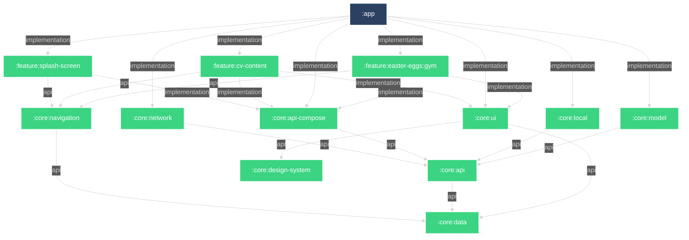

# Dependency Diagram

# Preface

This project is greatly over-complicated **_on purpose_**.
I wanted to show that I now how to:

- modularize app
- use advanced Gradle features likes:
    - precompiled convention plugins
    - precompiled binary plugins (:gradle:versioning-plugin)
    - included builds:
        - `:backend` project in ktor is in the same repository
        - `:shared:data-model` tiny module hosting DTO object for both this ktor backend and android app written in kotlin multiplatform
        - `:build-logic` aka slightly better `buildSrc`
        - `:deployment` where I use my own open source Gradle plugin [`gradle-ssh`](https://github.com/Dussim/gradle-ssh) for very simple deployment of the backend. I encourage to
          also look at this project
    - configure gradle in a way that both build and configuration cache works
    - enable remote build cache (even when launching this project first time the build should be quicker thanks to this)
- use dependency injection pattern by not using any frameworks for it
- use resource local and external to app (that is the reason why some data is just hardcoded in app and for small things like languages there is ktor backend)
- how to work with jenkins (look at `.jenkins` folder) in docker and docker agents for which I created my own image encapsulating whole environment needed to build app. In theory
  this image can be used as a base for `.devcontainer` or some other cloud based dev environment to start delivering for this app in matter of seconds on any machine, although
  Intellij/Android Studio still has very bare bone `devcontainer` support so I haven't done it yet.

And most important aspect: **just to have fun developing it**. 