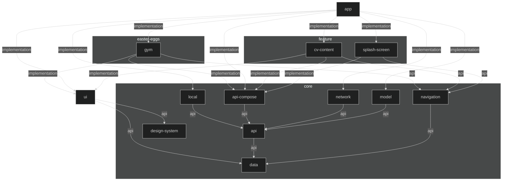

# Dependency Diagram

```mermaid
%%{
  init: {
    'theme': 'dark'
  }
}%%

graph TB

  subgraph core
    api
    api-compose
    data
    design-system
    local
    model
    navigation
    network
  end
  subgraph feature
    cv-content
    splash-screen
  end
  subgraph easter-eggs
    gym
  end
  model -- api --> api
  navigation -- api --> data
  api -- api --> data
  network -- api --> api
  api-compose -- api --> api
  splash-screen -- api --> navigation
  splash-screen -- implementation --> api-compose
  local -- api --> api
  cv-content -- api --> navigation
  cv-content -- implementation --> api-compose
  cv-content -- implementation --> ui
  ui -- api --> data
  ui -- api --> design-system
  app -- implementation --> api-compose
  app -- implementation --> ui
  app -- implementation --> model
  app -- implementation --> local
  app -- implementation --> network
  app -- implementation --> splash-screen
  app -- implementation --> cv-content
  app -- implementation --> gym
  gym -- api --> navigation
  gym -- implementation --> api-compose
  gym -- implementation --> ui

```