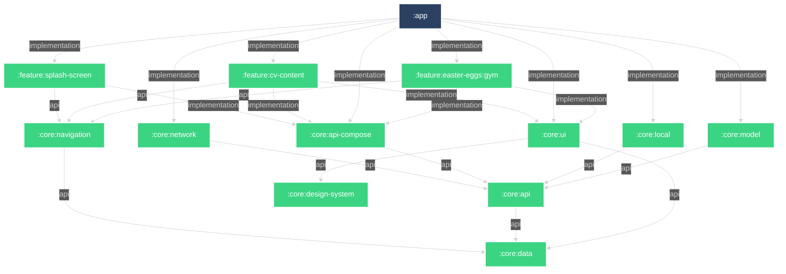

# Dependency Diagram

```mermaid
%%{
  init: {
    'theme': 'dark'
  }
}%%

graph TB
  :core:navigation -- api --> :core:data
  :core:network -- api --> :core:api
  :core:api-compose -- api --> :core:api
  :core:api -- api --> :core:data
  :feature:splash-screen -- api --> :core:navigation
  :feature:splash-screen -- implementation --> :core:api-compose
  :core:local -- api --> :core:api
  :core:ui -- api --> :core:data
  :core:ui -- api --> :core:design-system
  :feature:cv-content -- api --> :core:navigation
  :feature:cv-content -- implementation --> :core:api-compose
  :feature:cv-content -- implementation --> :core:ui
  :app -- implementation --> :core:api-compose
  :app -- implementation --> :core:ui
  :app -- implementation --> :core:model
  :app -- implementation --> :core:local
  :app -- implementation --> :core:network
  :app -- implementation --> :feature:splash-screen
  :app -- implementation --> :feature:cv-content
  :app -- implementation --> :feature:easter-eggs:gym
  :core:model -- api --> :core:api
  :feature:easter-eggs:gym -- api --> :core:navigation
  :feature:easter-eggs:gym -- implementation --> :core:api-compose
  :feature:easter-eggs:gym -- implementation --> :core:ui

classDef android-library fill:#3BD482,stroke:#fff,stroke-width:2px,color:#fff;
classDef android-application fill:#2C4162,stroke:#fff,stroke-width:2px,color:#fff;
class :core:navigation android-library
class :core:data android-library
class :core:network android-library
class :core:api android-library
class :core:api-compose android-library
class :feature:splash-screen android-library
class :core:local android-library
class :core:ui android-library
class :core:design-system android-library
class :feature:cv-content android-library
class :app android-application
class :core:model android-library
class :feature:easter-eggs:gym android-library

```