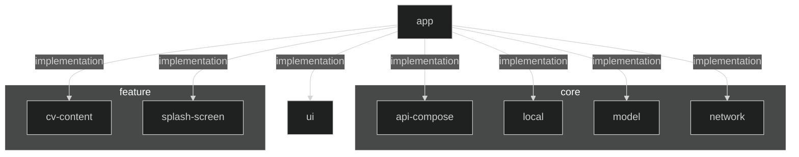

# Dependency Diagram

```mermaid
%%{
  init: {
    'theme': 'dark'
  }
}%%

graph TB

  subgraph core
    api-compose
    local
    model
    network
  end
  subgraph feature
    cv-content
    splash-screen
  end
  app -- implementation --> api-compose
  app -- implementation --> ui
  app -- implementation --> model
  app -- implementation --> local
  app -- implementation --> network
  app -- implementation --> splash-screen
  app -- implementation --> cv-content

```
# :app

Android Application top module