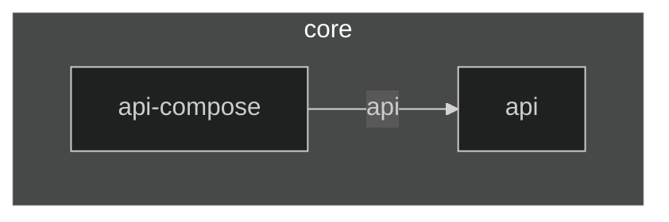

# Dependency Diagram

```mermaid
%%{
  init: {
    'theme': 'dark'
  }
}%%

graph TB
  subgraph core
    api
    api-compose
  end
  api-compose -- api --> api

```
# :core:api-compose

Extension for the [:core:api](../api/README.md) module that adds compose specific interfaces and components like different `LocalXyz`