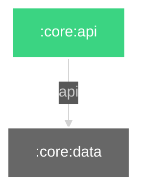

# Dependency Diagram

# :core:api

This is somewhat of a cheat, this module is place for all the interfaces and components etc. that should be shared across the whole project.

This comes with penalty of gradle potentially having to recompile the whole project when this module is changed.