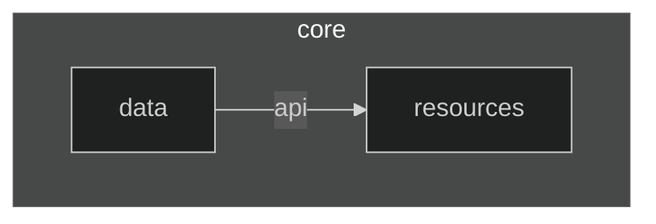

# Dependency Diagram

```mermaid
%%{
  init: {
    'theme': 'dark'
  }
}%%

graph TB
  subgraph core
    data
    resources
  end
  data -- api --> resources

```
# :core:data

This module contains domain data types definitions for whole project