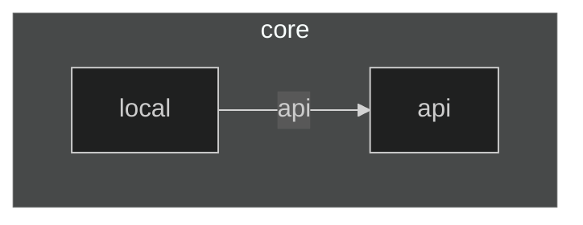

# Dependency Diagram

```mermaid
%%{
  init: {
    'theme': 'dark'
  }
}%%

graph TB
  subgraph core
    api
    local
  end
  local -- api --> api

```
# :core:local

This module contains local/static data sources implementations