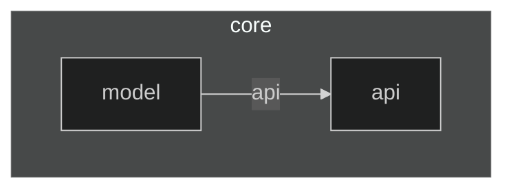

# Dependency Diagram

```mermaid
%%{
  init: {
    'theme': 'dark'
  }
}%%

graph TB
  subgraph core
    api
    model
  end
  model -- api --> api

```
# :core:model

This is the main domain model module that defines top level domain component. 

This also place where more complicated classes like network first data sources.