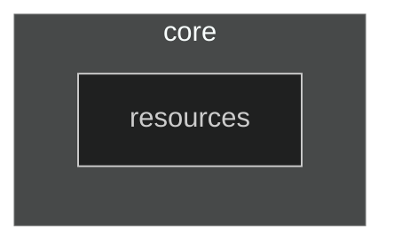

# Dependency Diagram

# :core:data

This module is just plain kotlin jvm library as of now. It needs to be because it will be used with spring backend module.

Later on I plan to refactor it to Kotlin Multiplatform library.