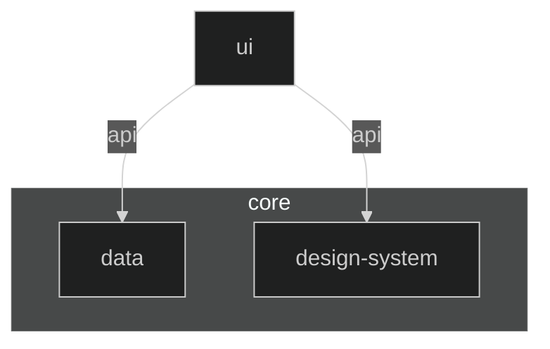

# Dependency Diagram

```mermaid
%%{
  init: {
    'theme': 'dark'
  }
}%%

graph TB
  subgraph core
    data
    design-system
  end
  ui -- api --> data
  ui -- api --> design-system
```
# :core:ui

This module hosts reusable UI components that are used across the application.