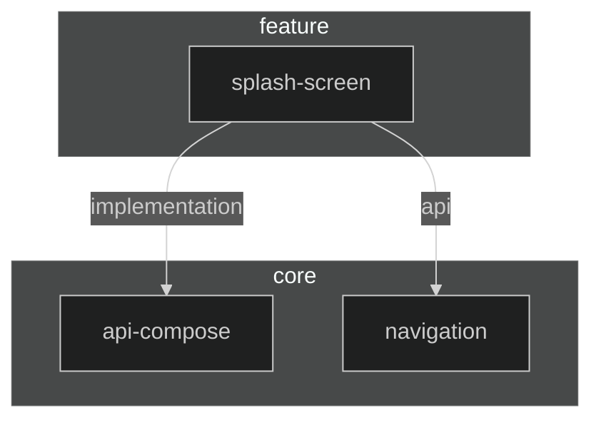

# Dependency Diagram

# :feature:splash-screen

This module contains implementation of splash screen feature. It doesn't do anything on its own, but it is used by the app module while app
is loading.
It also uses this time to download all necessary data from the server so that next screen will open with all data ready.